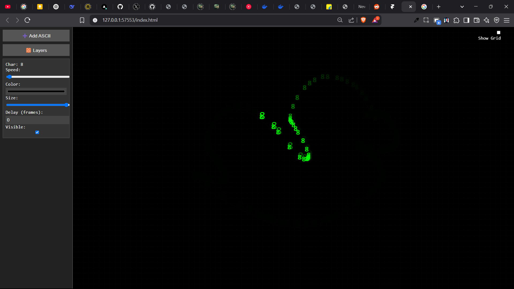

# ASCII Art Animation Tool

This project is an interactive ASCII art animation tool with a canvas and layered animation system.

## Features
- Draw paths for ASCII characters.
- Manage layers with controls for speed, color, size, and timing.
- Create dynamic ASCII animations.

## How to Run
1. Open `index.html` in a web browser.
2. Use the UI to add layers and draw animations.

## Future Enhancements
- Advanced path drawing.
- Optimization
- Export animations as files.